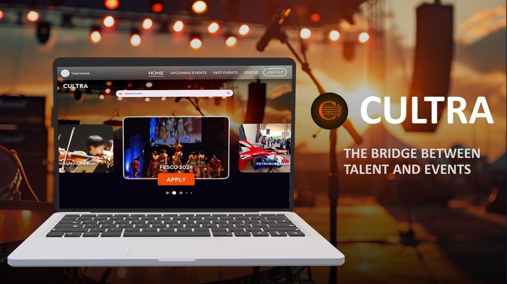

# CULTRA
> Team Project for `UTP E3S2 Hackathon 2024` in [*Universiti Teknologi PETRONAS*](https://www.utp.edu.my/Pages/Home.aspx). 

### Overview

**CULTRA** is a **web based social media application** designed to boost the hiring rate of artists and performers. It facilitates the planning of successful and memorable events by streamlining the process of hiring talent.

Collaborated with a team to develop a social media platform to boost the hiring rate of artists and performers, aim in a 30% increase in talent bookings of Malaysia’s cultural industry. Implementing HTML, CSS, and JavaScript for frontend web application development, implemented a robust backend using PHP and XAMPP, include Web API such as Swiper.js for enhanced user interactions. 

---
### Technologies involved
 -  HyperText Markup Langauge, HTML 5
 -  Cascading Style Sheet, CSS 3
 -  JavaScript, ES6
 -  PHP
 -  XAMPP
 -  [Swiper.js](https://swiperjs.com/get-started)
 -  [Figma](https://www.figma.com/design/QL9aq3tCZOSyLQjxdbNWB5/CULTRA?node-id=2-441&node-type=frame&t=aScNmTHNX9TlPA0n-0)

---
### Collaborators
1. [@waihauuuuu](https://github.com/waihauuuuu)
2. [@yihong8803](https://github.com/yihong8803)